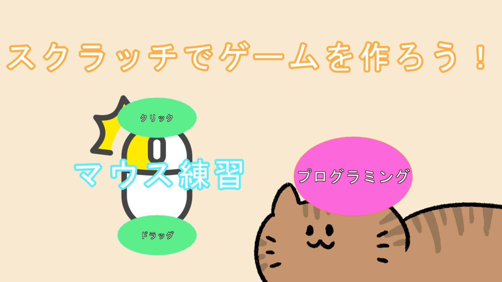

# # Scratchでゲームを作ろう！
地元の小学校でプログラミング教室を開く機会を頂いた際に、開発したプログラムです。  
WebView2を使って全てこのプログラムで学べるようにしています。  
集中できるように敢えて、強制前面になっています。  
Esc + Enterで終了できます。  

🔗[紹介サイト](https://miyagi-yuta.com/scratch-webview/)

## **動作環境**
ChromiumベースのMicrosoft Edge  
対象OS：Windows 10 以降  
操作機器：マウス&キーボード
 
## 操作方法
| **入力** | 動作 |
| :--: | :--: |
| クリック | 決定 |
| Esc + Enter | プログラム終了 |

## ライセンス  
### 画像  
[ぬれよん](https://nureyon.com/)  
[ONWAイラスト](https://onwa-illust.com/)  

### 音声
[効果音ラボ](https://soundeffect-lab.info/)  
[こんとどぅふぇ](https://conte-de-fees.com/)  
